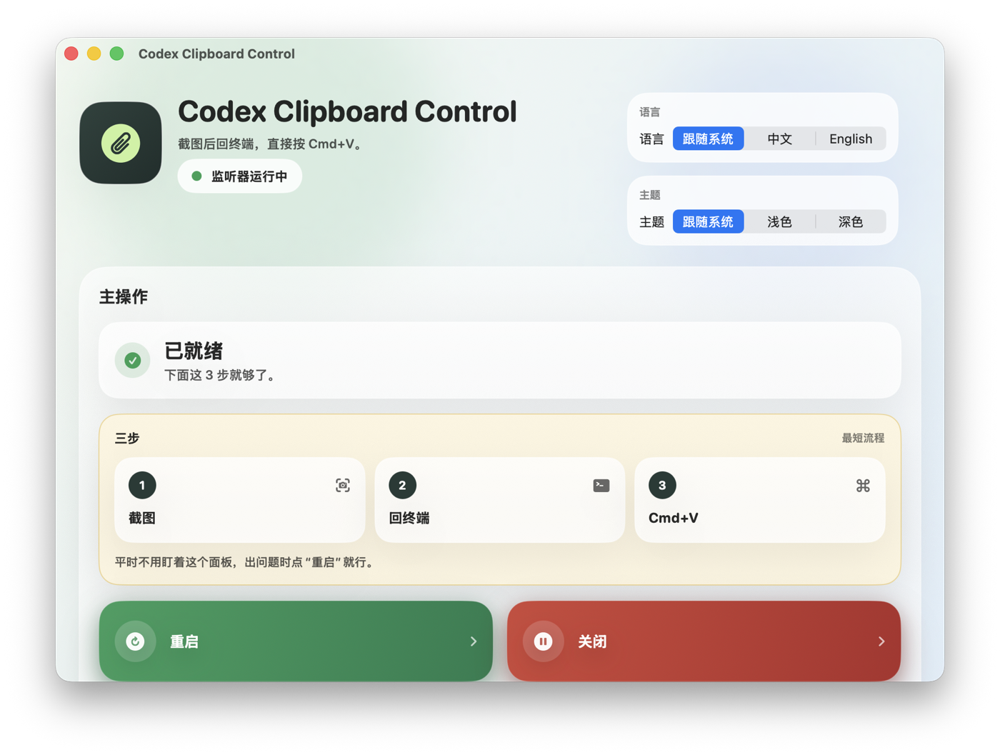

# Codex Clipboard Control

[English](./README.md) | [简体中文](./README.zh-CN.md)

A tiny macOS bridge that lets screenshots paste directly into terminal-based AI agents.

Core promise: take a screenshot with your existing screenshot app, return to Terminal or an agent CLI, press `Cmd+V`.

- In Terminal/Codex, pasted screenshots become file paths automatically.
- In normal apps like WeChat, Feishu, browsers, or notes, the same clipboard is restored back to a real image.
- Includes a SwiftUI control panel for start/stop, cache inspection, logs, theme switching, and Chinese/English UI switching.



## What It Solves

Many terminal chat clients cannot accept a raw image from the system clipboard. They only accept file paths or dragged files. This project adds a background clipboard watcher that:

1. Detects when your clipboard changes to an image
2. Converts that image to a temporary file only while a supported terminal is frontmost
3. Restores the clipboard back to the actual image when you switch to a normal app

## Requirements

- macOS 13+
- `swiftc`
- `osacompile`
- `launchctl`

These are available on a normal macOS developer machine with Xcode Command Line Tools.

## Install

For early users, unzip a release build and double-click:

```text
install.command
```

For CLI install:

```bash
zsh scripts/install.sh
```

This installs:

- helper binaries into `~/.local/share/codex-clipboard-control/bin`
- command wrappers into `~/.local/bin`
- app bundles into `~/Applications`
- a LaunchAgent into `~/Library/LaunchAgents`

## Daily Usage

Once installed and running:

1. Screenshot as usual with iShot or another screenshot tool
2. Return to Terminal / Codex
3. Press `Cmd+V`

If you paste inside a normal GUI app, the clipboard is restored as an image again.

## Commands

```bash
codex-clipboard-control-ui
codex-paste-image
```

- `codex-clipboard-control-ui`: opens the graphical control panel
- `codex-paste-image`: manual helper that saves the current clipboard image and pastes its path

## Create a Release Zip

```bash
zsh scripts/package.sh
```

This writes a distributable archive into `dist/`. The zip includes `install.command` for double-click installation.

## Supported Terminal Detection

The auto-conversion logic currently recognizes:

- Terminal.app
- iTerm2
- Warp
- Ghostty

## Files

- `src/swift`: Swift helper binaries and the SwiftUI control panel
- `src/jxa`: JXA applets used for background automation and launcher behavior
- `templates/launchd`: LaunchAgent template
- `scripts/install.sh`: local installer
- `scripts/uninstall.sh`: local uninstaller

## Uninstall

```bash
zsh scripts/uninstall.sh
```

## Troubleshooting

- Auto paste not working: restart the agent from the control panel.
- Other apps still paste text: make sure the latest screenshot was taken while the agent was running.
- Run diagnostics:

```bash
zsh scripts/diagnose.sh
```

More detail: [Troubleshooting](./docs/TROUBLESHOOTING.md)

## Stage 1 Validation

Before charging for the product, test whether real terminal-agent users keep it running after the first day.

Use this checklist: [Stage 1 Testing Matrix](./docs/TESTING_MATRIX.md)

## Feedback

When reporting a problem, include:

- macOS version
- screenshot app name
- terminal or agent CLI name
- output from `zsh scripts/diagnose.sh`

For early validation, ask testers one question first: after taking a screenshot, did returning to the terminal and pressing `Cmd+V` feel natural enough to keep this app installed?

## License

MIT
